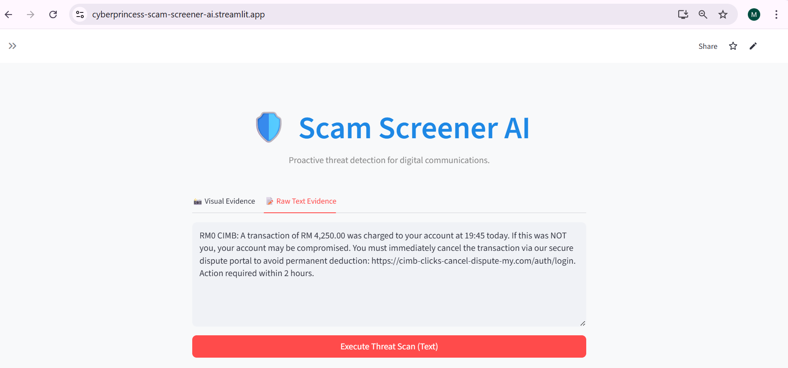
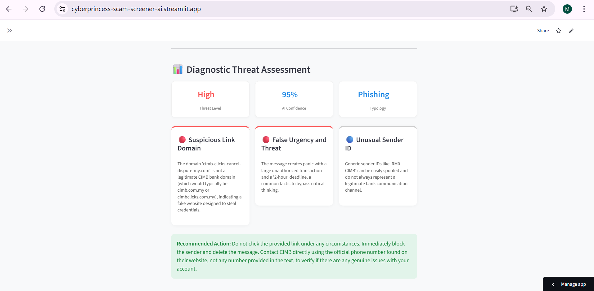
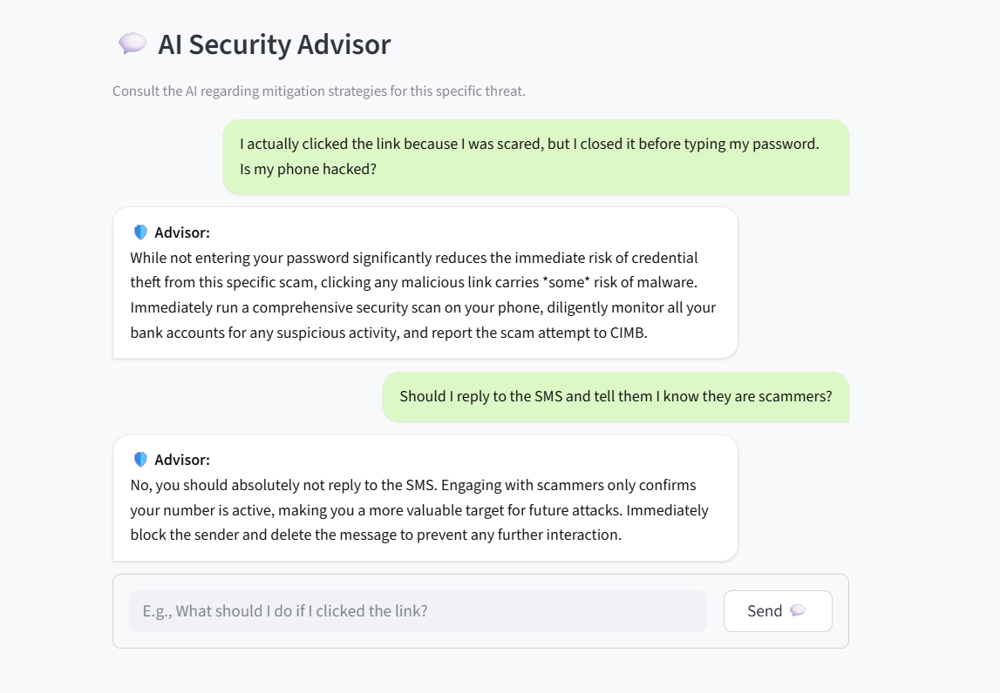
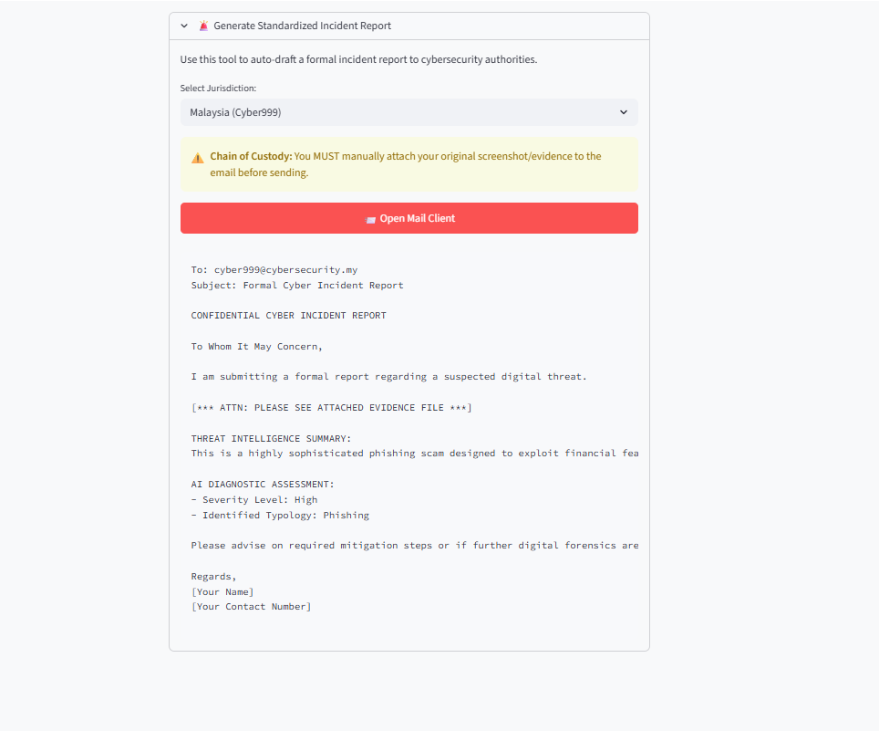
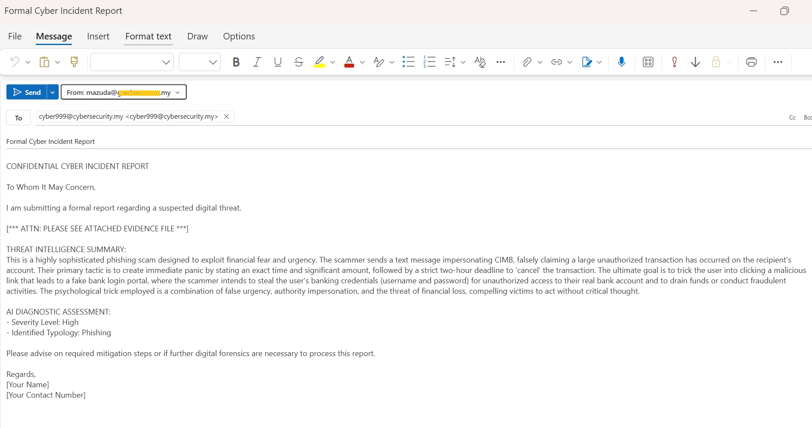
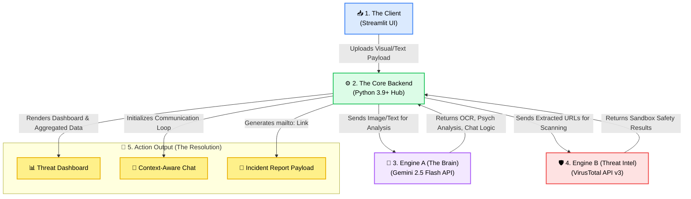

# 🛡️ Scam Screener AI  
### The Digital X-Ray for Suspicious Communications — with Built-in Guidance & Reporting


---

## 🟢 Try it Live
**Access the fully functional web application here:** 👉 **[Scam Screener AI - Live Dashboard](https://cyberprincess-scam-screener-ai.streamlit.app/)**

---

## 🚀 Overview

**Scam Screener AI** is a zero-trust threat analysis web application that helps users detect and respond to potential cyber scams in real time.

Instead of just flagging a threat, the system provides a complete incident response workflow. Users can safely upload suspicious screenshots or paste text messages to:
* **🔍 Detect Threats:** Instantly identify psychological manipulation tactics, authority impersonation, and malicious links via VirusTotal.
* **🧠 Understand the Risk:** Chat with a built-in, Context-Aware AI Advisor to break the psychological spell and de-escalate panic.
* **⚡ Take Action:** Automatically generate structured, evidence-backed incident reports ready to send to centralized national authorities.

Unlike traditional detection tools, Scam Screener AI doesn't just leave users with a red warning screen — it **guides them on exactly what to do next, all within a single unified interface**.

---

## 🎯 Problem Statement

Social engineering scams (phishing, smishing, impersonation attacks) continue to bypass traditional security systems because they target human psychology rather than technical vulnerabilities.

Existing solutions:
- Require technical knowledge
- Provide raw detection results without guidance
- Force users to switch between multiple tools for verification and reporting

There is a need for an **automated, user-friendly, zero-trust assistant** that can detect, explain, and help respond to scams in real time.

---

## 🚀 What Makes This Different

Unlike traditional scam detection tools, Scam Screener AI is a complete **end-to-end scam response system**, not just a detector.

- 🧠 **All-in-One Workflow:** Detect, analyze, chat, and report without leaving the platform  
- 💬 **Context-Aware AI Advisor:** Built-in AI chat explains threats and reduces user panic  
- 📧 **Automated Incident Reporting:** Generates structured emails for cybersecurity authorities  
- ⚡ **Seamless Experience:** Eliminates switching between apps or tabs during emergencies  
- 🛡️ **Guided Response System:** Helps users take action, not just identify threats  

👉 This transforms the system from a detection tool into a **guided cybersecurity assistant**.

---

## 🔄 System Workflow & Key Features

> ⚙️ **Dual-Engine System:** Combines AI-based scam detection (Google Gemini) and URL threat intelligence (VirusTotal).

### 1. Evidence Ingestion
Users upload screenshots or paste suspicious messages into a secure analysis environment.



---

### 2. Diagnostic Threat Dashboard
The system analyzes content and highlights scam indicators such as urgency, authority impersonation, and suspicious links.



---

### 3. Contextual AI Security Advisor
A built-in AI assistant provides real-time explanations and safety guidance based on the detected threat.



---

### 4. Automated Incident Reporting
Generates a structured cybersecurity incident report for authorities such as Cyber999 Malaysia.



---

### 5. Seamless Authority Handoff
Users can directly send the report via their email client with minimal effort.



---
## ⚙️ System Architecture Data Flow


---

## 🛠️ Tech Stack

- **Frontend:** Streamlit (Python)
- **AI Engine:** Google Gemini 2.5 Flash
- **Threat Intelligence:** VirusTotal API v3
- **Image Processing:** Pillow (PIL)

---

## ⚙️ Setup Instructions

### 1. Prerequisites
- Python 3.9+
- Git

---

### 2. Clone Repository

```bash
git clone https://github.com/mazuda-zaki/scam-screener-ai.git
cd scam-screener-ai
```

### 3. Create Virtual Environment

```bash
python -m venv venv
```

Activate the environment:

**Windows:**
```bash
venv\Scripts\activate
```

**macOS/Linux:**
```bash
source venv/bin/activate
```

### 4. Install Dependencies

```bash
pip install -r requirements.txt
```

### 5. Configure API Keys
Create a `.streamlit/secrets.toml` file in the root directory:

```toml
GEMINI_API_KEY = "your_google_gemini_key_here"
VIRUSTOTAL_API_KEY = "your_virustotal_key_here"
```
> ⚠️ **Security Notice:** Do NOT commit this file to GitHub. Ensure `.streamlit/` is in your `.gitignore`.

### 6. Run Application

```bash
streamlit run app/main.py
```

---

## 📂 File Structure

```text
scam-screener-ai/
│
├── app/                      # Core Application Logic
│   ├── main.py               # Main Entry Point
│   ├── ai_engine.py          # AI Prompting & Backend APIs
│   └── ui_components.py      # UI Rendering & Modals
│
├── assets/                   # Static Media & Styling
│   ├── images/               # Application Screenshots
│   └── styles/
│       └── style.css         # Custom UI Styling
│
├── docs/                     # Documentation
│   └── flowchart.md          # System Architecture
│
├── .gitignore                # Security Rules
├── README.md                 # Project Documentation
└── requirements.txt          # Python Dependencies
```

---

## 🧪 Testing & Validation
The system was evaluated using real-world scam scenarios to ensure reliability and accuracy.

* **AI Scam Detection:** Tested on phishing, smishing, and impersonation messages.
* **URL Verification:** Validated using malicious and safe URLs via VirusTotal.
* **False Positive Control:** Guardrails ensure normal urgent messages are not misclassified.

---

## ⚠️ Limitations

* Requires internet connection for AI and API services.
* Accuracy depends on external AI model performance.
* Highly sophisticated scams may still require human judgment.

---

## 🔮 Future Work

* 📱 **Messaging Bot Deployment:** Integrating the engine into WhatsApp and Telegram via API, allowing users to simply "forward" suspicious messages or images to a bot for frictionless, instant analysis.
* 🎙️ **Deepfake Audio Analysis:** Expanding ingestion capabilities to analyze voice notes and detect synthetic speech or AI-generated voice cloning used in modern impersonation scams.
* 🗣️ **Localized NLP Fine-Tuning:** While the base model is naturally multilingual, future iterations will be fine-tuned to specifically detect manipulation tactics hidden within regional slang, Manglish, and informal text abbreviations.
* 🗺️ **Crowdsourced Threat Heatmap:** Aggregating anonymized diagnostic data to create a live, public dashboard tracking trending scam campaigns and active threat vectors in real-time.

---

## 🏁 Summary
Scam Screener AI is not just a detection tool — it is a guided scam response assistant that helps users detect, understand, and respond to cyber threats in a single unified workflow.
