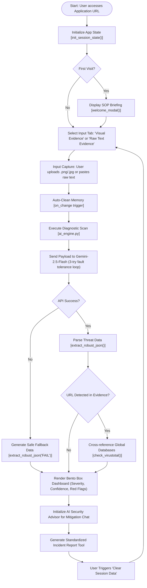

```mermaid
graph TD
    Start(["Start: User accesses Application URL"])
    Start --> InitializeSystem["Initialize App State [init_session_state()]"]
    
    InitializeSystem --> DecisionFirstVisit{"First Visit?"}
    DecisionFirstVisit -- Yes --> TriggerWelcome["Display SOP Briefing [welcome_modal()]"]
    DecisionFirstVisit -- No --> SelectInput

    TriggerWelcome --> SelectInput

    SelectInput["Select Input Tab: 'Visual Evidence' or 'Raw Text Evidence'"]
    SelectInput --> CaptureInput["Input Capture: User uploads .png/.jpg or pastes raw text"]
    CaptureInput --> AutoReset["Auto-Clean Memory [on_change trigger]"]

    AutoReset --> ExecuteScan["Execute Diagnostic Scan [ai_engine.py]"]
    ExecuteScan --> ApiRequest["Send Payload to Gemini-2.5-Flash (3-try fault tolerance loop)"]
    
    ApiRequest --> DecisionApiSuccess{"API Success?"}
    
    DecisionApiSuccess -- No --> ReturnFail["Generate Safe Fallback Data [extract_robust_json('FAIL')]"]
    DecisionApiSuccess -- Yes --> RobustExtraction["Parse Threat Data [extract_robust_json()]"]

    ReturnFail --> PopulateDashboard 
    
    RobustExtraction --> DecisionUrlDetected{"URL Detected in Evidence?"}
    DecisionUrlDetected -- Yes --> CallVirusTotal["Cross-reference Global Databases [check_virustotal()]"]
    DecisionUrlDetected -- No --> PopulateDashboard

    CallVirusTotal --> PopulateDashboard

    PopulateDashboard["Render Bento Box Dashboard (Severity, Confidence, Red Flags)"]
    PopulateDashboard --> InitializeAdvisor["Initialize AI Security Advisor for Mitigation Chat"]
    InitializeAdvisor --> GenerateReport["Generate Standardized Incident Report Tool"]

    GenerateReport --> SessionWipe["User Triggers 'Clear Session Data'"]
    
    SessionWipe --> SelectInput
```
